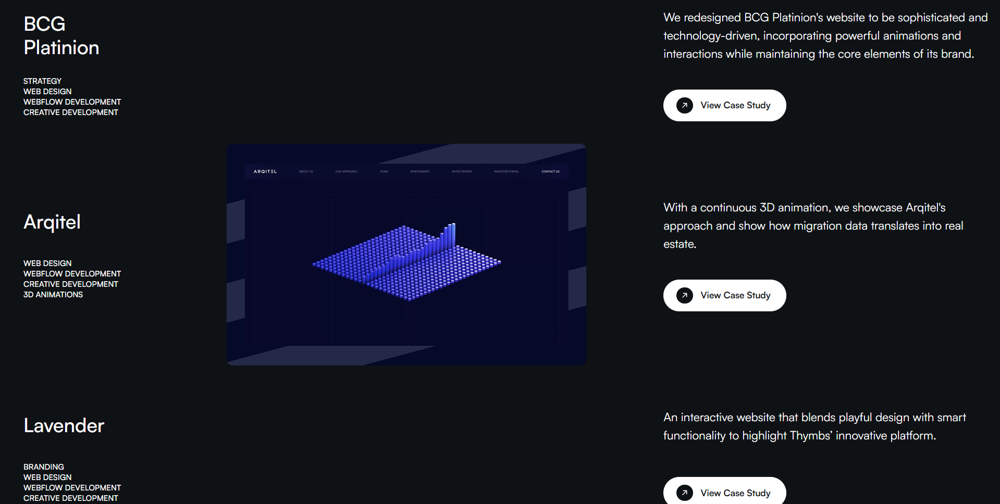
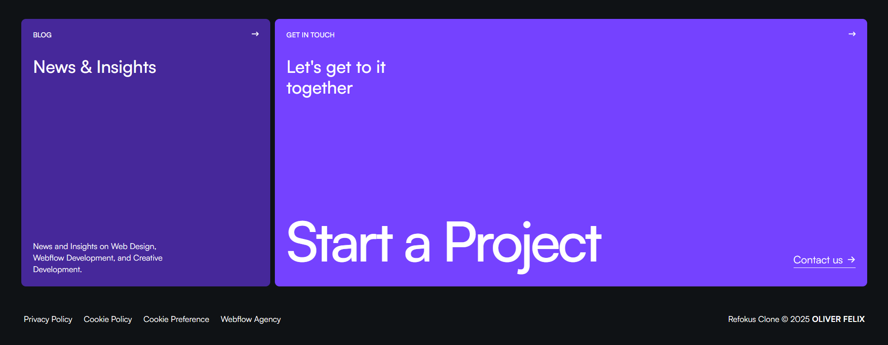

# Refokus

Refokus is a clone of [refocus.com/work](https://refocus.com/work) built for learning purpose. The project showcases advanced animations, responsiveness, and leverages several animation libraries to deliver a visually appealing user experience.

## Features
- **Responsive Design**: The layout is fully responsive, ensuring compatibility across various devices and screen sizes.
- **Advanced Animations**: Incorporates awwward-level animations using libraries like GSAP and Emotion.
- **React**: Utilizes React for streamlined component management and enhanced functionality.

## Screenshots


*Work Component*


*Footer*

## Technologies Used
- **React JS**: For efficient and scalable component management.
- **GSAP (GreenSock Animation Platform)**: For creating high-performance animations.
- **Vite**: A fast build tool for modern web projects.
- **Tailwind CSS**: A utility-first CSS framework for rapid UI development.

## Installation

1. Clone the repository:
   ```bash
   git clone https://github.com/oliverfelixdev/Refokus.git
   ```
2. Navigate to the project directory:
   ```bash
   cd Refokus
   ```
3. Install dependencies:
   ```bash
   npm install
   ```
4. Start the development server:
   ```bash
   npm run dev
   ```

## License
This project is licensed under the MIT License.

## Contact
For any questions or feedback, feel free to reach out to Oliver at [oliverfelix.dev@gmail.com](mailto:oliverfelix.dev@gmail.com).